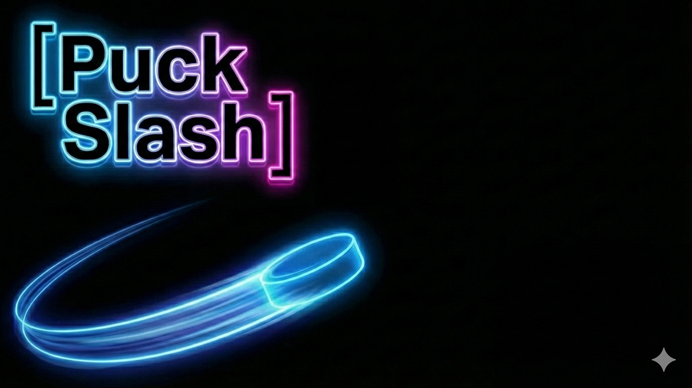

<!-- HERO (centered banner) -->
<h1 align="center">Puck Slash</h1>

<em>A fast-paced drag-and-slash action prototype built with Unity.</em>

  

---

## About the Project
**Puck Slash**는  
드래그/홀드 조작을 활용한 짧고 강렬한 전투 루프를 가진  
**탑다운 액션·캐주얼 프로토타입**입니다.

궁수의 전설 + 뱀서라이크 템포에,  
퍽(Puck)을 직접 밀고 쏘는 조작감을 더한 형태로 설계했습니다.

현재는 조작 실험 / 전투 루프 / 기본 무기 프로토타입 단계이며,  
기획 기반만 유지한 WIP 상태입니다.

---

## Core Concept (Brief)
- **드래그 & 홀드 조작 기반** 근접/원거리 액션  
- **짧은 전투 반복 루프** (30초 생존 → 다음 층)  
- **LED 스타일 단색 그래픽**  
- 웹/모바일 양쪽을 고려한 **직관적인 조작감 실험**이 주 목적  

---

## Status
**Status: WIP / Prototype**  
아직 개발 중이며 기능은 일부만 구현됨.  
전투 조작과 컨트롤 실험에 집중한 초기 버전입니다.

---

## Roadmap

### Core Systems
- [O] 플레이어 드래그/홀드 입력 확장  
- [ ] 스킬/업그레이드 선택 시스템  
- [ ] 층 구조(던전 러닝 루프)

### Combat
- [ ] 근접/원거리 무기 종류 확장  
- [ ] 충돌·대시 타격감 개선  
- [ ] 전투 실패/성공 흐름 정식 구현

### Enemy
- [ ] 기본 AI 개선  
- [ ] 유닛 패턴 다양화  
- [ ] 간단한 보스 패턴

### Visual / UX
- [ ] LED 외곽선 스타일 적용  
- [ ] 히트/피격/대시 FX  
- [ ] 모바일/WebGL 조작 최적화

---

##  Development Purpose
이 프로젝트는  
한 손으로 전투 전체를 구성하는 조작 시스템을 실험하기 위해 제작된 프로토타입입니다.
